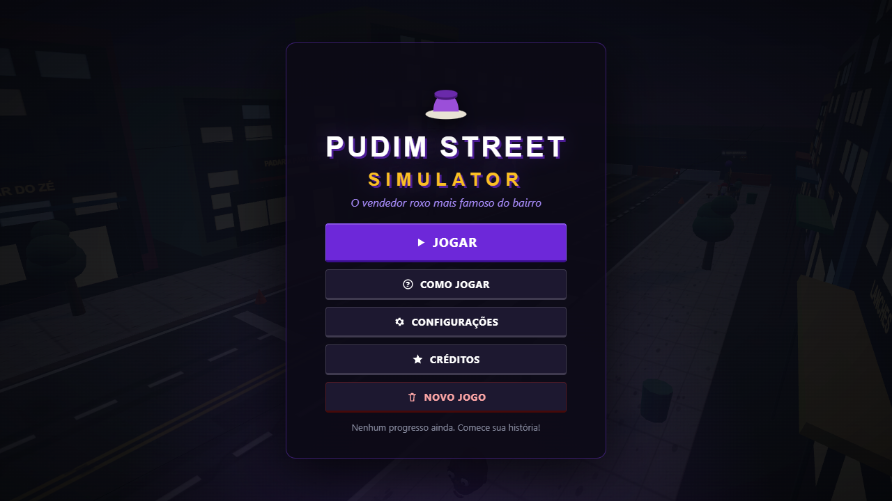
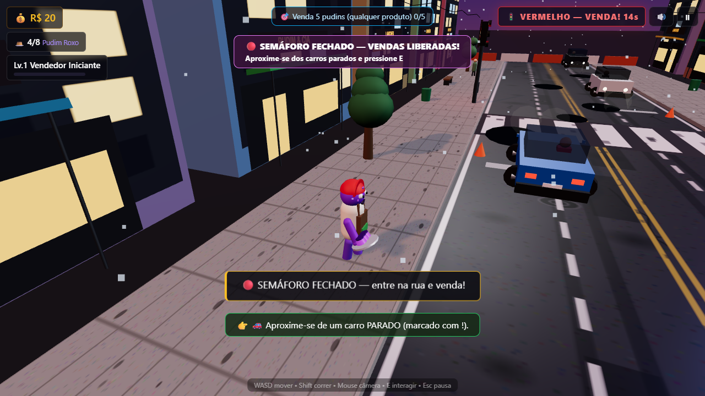
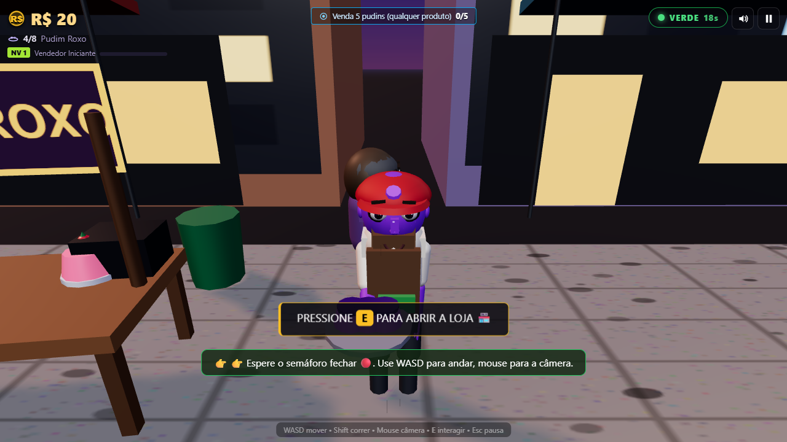
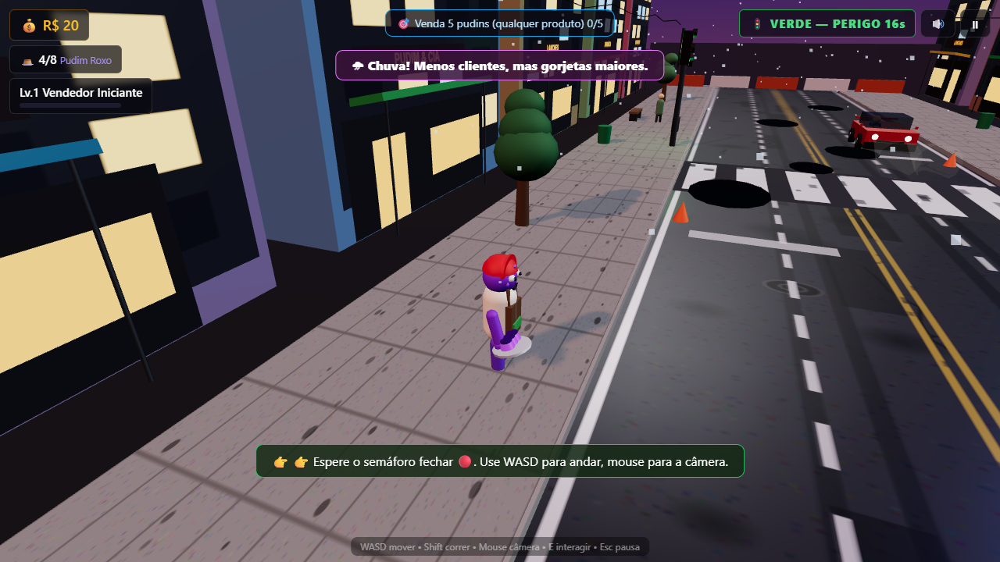

# 🍮 PUDIM STREET SIMULATOR


**Um jogo 3D completo para navegador: você é um vendedor ambulante roxo de pudim.**
Compre estoque → espere o semáforo fechar → venda nos carros parados → volte à calçada → invista → repita. Sem assets externos: cenário 100% procedural, áudio 100% sintetizado via WebAudio.

| Menu | Gameplay |
|---|---|
|  |  |
| Personagem | Chuva |
|  |  |

>imagens capturadas do jogo rodando (QA automatizado com Playwright + Chrome headless).

## Stack (decisão técnica)

**Vite + Three.js (WebGL) + JS modular, zero assets externos.**
Avaliados: Three.js vs Babylon.js vs React Three Fiber.
Three.js venceu por: menor bundle/overhead, controle direto de performance (pooling, draw calls),
materiais PBR + sombras prontos, e desenvolvimento rápido sem camada React.
Áudio 100% sintetizado via WebAudio (sem arquivos). Física: cinemática própria + AABB
(estabilidade > simulação pesada para este escopo).

## Como executar

```bash
npm install
npm run dev      # desenvolvimento (http://localhost:5173)
npm run build    # build de produção -> dist/
npm run preview  # serve o build (http://localhost:4173)
```

> Abra via servidor (`dev`/`preview`), não direto como arquivo, por causa dos módulos ES.
> Debug interno: abra com `?debug=1` (dinheiro, semáforo, VIP, chuva, sem colisão...).

## Controles

WASD mover • Shift correr • Mouse câmera (clique trava) • Scroll zoom • **E** interagir/vender/loja • Esc pausa • M mudo

## Sistemas principais (`src/`)

| Sistema | Arquivo |
|---|---|
| Orquestração/loop/estados | `core/Game.js` |
| Entrada (teclado+mouse) | `core/Input.js` |
| Save localStorage | `core/Save.js` |
| Balanceamento/qualidade | `core/Config.js` |
| Mapa procedural + barraca 4 tiers | `world/Map.js` |
| Semáforo (máquina de estados) | `world/TrafficLight.js` |
| Trânsito (pool, filas, maluco) | `world/Traffic.js` |
| Personagem roxo animado | `world/Player.js` |
| Câmera 3ª pessoa c/ colisão | `world/ThirdCamera.js` |
| Chuva/chão molhado | `world/Weather.js` |
| Partículas/números flutuantes | `world/Effects.js` |
| Venda + clientes especiais | `systems/Selling.js` |
| Economia/estoque | `systems/Economy.js` |
| 6 upgrades x 5 níveis | `systems/Upgrades.js` |
| XP/níveis/combo | `systems/Progression.js` |
| 8 missões | `systems/Missions.js` |
| 6 eventos aleatórios | `systems/Events.js` |
| Áudio sintetizado | `systems/AudioSys.js` |
| HUD/loja/menus/tutorial | `ui/UI.js` |
| Dados (produtos/missões/clientes) | `data/Data.js` |

## Game loop

Barraca (E) → espera VERDE → VERMELHO → rua → carro parado (!) → E → resultado
(dinheiro/XP/combo/gorjeta/VIP) → calçada → loja → repetir. Atropelamento = perde
dinheiro+estoque+combo e volta à calçada (2.5s de proteção).

## Qualidade (BAIXO/MÉDIO/ALTO/ULTRA)

Controlam de verdade: pixelRatio, sombras on/off + resolução do shadow map,
quantidade de chuva. Pool de carros (12), partículas em pool, sem pós-processamento
pesado, texturas procedurais via canvas (asfalto, calçada, fachadas, placas).

## Limitações reais conhecidas

- Semáforo usa ciclo 20/3/18s (não 30s) por ritmo de gameplay — ajustável em `core/Config.js`.
- Antialias fixo do contexto (qualidade não recria o contexto WebGL).
- Sem multiplayer/mobile-touch (arquitetura separada por sistemas permite adicionar).
- Sombras: 1 direcional + até 4 point lights (proposital, por performance).

## Etapa 2 — game feel e robustez

- **Movimento**: lean direcional, poeira ao correr, escala ~1.85m, push-out (não atravessa carros).
- **Câmera**: FOV/distância dinâmicos na corrida, trauma/shake em impactos, anti-clipping por raycast.
- **Trânsito**: 5 carrocerias (compacto, sedan, SUV, van, táxi), personalidades (acel/frenagem/follow/offset),
  onda de arranque no verde, motoristas que olham para o jogador e reagem (nod/shake, badges !/?/✓/✗).
- **Venda em 2 fases** (oferta → decisão), sorte com peso real (+1.5% chance/nv, qty extra, gorjetas).
- **Perigo**: vinheta direcional, whoosh com pan estéreo, micro-shake, hitstop + flash vermelho no atropelamento.
- **Áudio**: pan por lado, pitch variado, cooldowns, suspend na pausa, buzina ambiente ocasional.
- **Mundo vivo**: 3 pedestres (andam/esperam/atravessam), árvores balançando, poças na chuva,
  humor de luz por estado do semáforo, spotlight que segue o carro mais próximo.
- **Progressão**: toast de produto desbloqueado, +XP flutuante, marcos de combo, resumo de sessão ao sair.
- **Acessibilidade real**: inverter Y, escala de UI, reduzir efeitos, modo daltônico (azul/laranja).
- **Robustez**: save com detecção de corrupção, anti-venda-dupla, auto-qualidade por FPS, pausa congela tudo.

## Etapa 3 — direção de arte (validada com screenshots headless)

- **QA visual real**: harness `qa-shot.mjs` (Playwright + Chrome + SwiftShader) — menu, gameplay,
  venda, chuva e loja inspecionados por screenshot; todos os achados abaixo vieram de imagens reais.
- **Luz**: sol mais neutro + preenchimento frio, exposição e hemi recalibrados, reflexos via
  PMREM/RoomEnvironment (metais e tintas com `envMapIntensity` contido), spotlight no carro próximo,
  humor por estado do semáforo.
- **Rua**: remendos, bueiros, faixas finas desgastadas, faixas de retenção, zebrinha gasta,
  calçada com manchas de uso, poças reflexivas na chuva, nuvens à deriva.
- **Prédios**: paleta clara, 3 variações de janela, térreo com vitrines acesas, toldos com hastes,
  placas fictícias, postes com braço e caixa de controle no semáforo.
- **Personagem**: pernas roxas legíveis, bochechas, broche de pudim no boné, alças no avental,
  tênis com biqueira, piscar + respirar, bandeja mostra o produto equipado.
- **Produtos**: silhuetas próprias (flan, choco, morango, sachê, garrafinha, brigadeiros),
  no mostruário da barraca e na bandeja, com brilho sutil p/ leitura ao entardecer.
- **Carros**: 5 carrocerias assentadas (sem flutuar), grade/placa/retrovisores, vidros que revelam
  o motorista, tintas com presença no contraluz, badges na altura de cada tipo.
- **Venda**: notas voando do carro ao jogador, cliente balança/acena, HUD atualiza na hora.
- **Primeiros 30s**: marcador "🏪 SUA BARRACA" sobre a loja até o fim do tutorial.
- **UI**: chips/painéis contidos (raio 6–8px, bordas finas), números tabulares, sem gradiente
  gritante; roxo = identidade (jogador/barraca), vermelho = perigo, verde = oportunidade,
  âmbar = atenção; paleta funcional documentada.

## Etapa 4 — humanos e UI com identidade (QA por screenshot)

- **Humanoid.js**: fábrica paramétrica — membros em 2 segmentos (joelho/cotovelo),
  rosto com órbita + esclera + íris + pupila + brilho, nariz, orelhas, mandíbula,
  sobrancelhas assimétricas, dedos (polegar + 4 falanges), pele (roughness alto, sem plástico),
  tecido em camada sobre o corpo; walk com peso (quadril 2x/ciclo, ombros opostos, cabeça estável,
  fase pela distância — sem moonwalk).
- **Jogador**: reconstruído — avental em camadas, boné com broche, bandeja nivelada por código,
  piscar, respirar, venda com braço estendido.
- **Pedestres**: 4 modulares (pele/cabelo/roupa/altura/passo variados, 5 penteados), sem clones.
- **Motoristas**: tronco, braços até o volante com mãos no aro, rosto, banco/painel/piso interno.
- **Carros**: interior visível no vidro, grade/placa/retrovisores, tintas com presença.
- **UI rebuild**: ícones SVG próprios (sem emoji estrutural), HUD sem cards (texto + sombra),
  pílula de semáforo, botões táteis com estados, título condensado com sombra dura,
  menu com vinheta cinematográfica; paleta funcional estrita.
- **Bugs achados pelo QA e corrigidos**: marcador atrás da câmera projetava gigante
  (checagem direcional + janela de distância), `SKIN` indefinido no init, `scene` sem `this`,
  typo "Equioso", cardápio estourado, chuva invisível, badge dentro do teto.

## Intervenção crítica — auditoria visual/técnica (QA por screenshot)

Bugs críticos corrigidos (todos confirmados em imagem):
- **Cabeça flutuante**: `buildFace` usava Y absoluto dentro do grupo local → crânio a 3.3m.
  Rosto remontado em coordenadas locais com medidas coerentes + boné reassentado.
- **Rodas "moeda"**: Euler XYZ com `rotation.x=90°` + incremento em `z` balançava o aro.
  Hierarquia `pivot (steer) → mesh (roll)`, geometria pré-rotacionada, rolagem = `v·dt/raio`
  no referencial local (antes, uma faixa rolava para trás!). Pneus foscos, cubo herda o giro.
- **Poças espelho**: viraram camada d'água — blobs irregulares pequenos, fora da faixa,
  `roughness 0.45`, `envI 0.3`, sem metalness; molhado = asfalto mais escuro + cetim,
  seco = claro + áspero (diferença evidente, sem plástico).
- Chuva com vento lateral; hint de controles some após tutorial/4min.

Checklist: personagem/pedestres/motoristas verificados em close, rodas/pneus no chão (y=raio),
escala auditada (1.76m × sedã 1.55m × semáforo 4.2m × poste 5.4m), sem clipping/flutuação,
steering com pivô pronto (rua é reta — nunca esterça), LOD por contagem fixa + sem sombra
no fundo. Limites honestos: sem LOD geométrico progressivo, sem teste de vídeo em movimento.
